# ServiceOps complete platform manual

Version 1.27.22 · Visual walkthrough edition

See `docs/MASTER_REFERENCE.md` for a single merged document that also
includes the governed backlog, traceability matrix, ITIL hierarchy
reference, BP-001 blueprint traceability, REST API reference, and a fresh
whole-application audit alongside this manual — useful as one-stop context
for an AI agent or new engineer.

## 1. Purpose and operating model

ServiceOps is an enterprise service-management platform for requesters,
fulfillers, team managers, CCB members, and platform administrators. It includes
incident, request, problem, change, catalog, knowledge, CMDB, asset, SLA,
approval, audit, analytics, and enterprise workspaces.

No deployment mechanism can eliminate every infrastructure or operator failure.
The ServiceOps production standard therefore uses prevention, validation,
observability, tested recovery, least privilege, immutable releases, and
documented rollback rather than claiming infallibility.

## 2. Roles and teams

| Role | Normal responsibilities |
|---|---|
| Requester | Submit and track requests and incidents, search knowledge |
| Agent | Triage, assign, fulfill, document, and resolve operational work |
| Manager | Agent work plus team oversight and manager approvals |
| CCB member | Review planned changes, risk, evidence, schedule, and backout plan |
| Administrator | Identity, service operations settings, CMDB, audit, and platform operation |

CoreApps, Database, Network, Windows, Unix, and SSD are standard fulfillment
teams. Administrators can map AD groups such as `gg_unix` to the Unix team;
membership reconciles whenever the user logs in through AD/LDAP. Team-manager
appointment and CCB approval authority remain explicit administrative
decisions. Only active users granted `CCB approver` authority participate in
new CCB approval gates. Normal and emergency changes follow manager assessment
and CCB authorization.

Operational ownership is separate from approval authority. Every incident,
service request, and change has one owning IT fulfillment team. An active
member of that team, its configured manager, or a platform administrator can
change operational fields. Assignees must remain active members of the owning
team. Active members and managers of every IT fulfillment team can read all
incidents and changes through lists, search, direct URLs, dashboards, analytics,
task boards, history and attachments. This shared visibility supports triage,
handoffs and operational awareness, but only the owning team or a platform
administrator can change the parent ticket. A named approver can see the record
needed for the decision, but CCB membership grants approval authority only and
does not grant cross-team operational control. Administrator actions remain
audited.

## 3. End-user guide

### REST API documentation

The complete integration guide is maintained in `docs/API_REFERENCE.md` and is
served by the running application at `/api/v1/docs`. The machine-readable
OpenAPI 3.1 contract is `/api/v1/openapi.json`. It documents authentication,
scopes, tenant and team authorization, field projections, idempotency,
pagination, ticket operations, workflow triggers, monitoring ingestion,
errors, retries, cURL and Python examples, and the explicit current
compatibility boundary.

### Governed record projections

Record visibility and field visibility are separate controls. Central
tenant-aware object policies decide whether a user can discover or access a
record. The validated Git-backed policy in
`config/field_projections.json` then decides which fields may leave the
application for that resource and audience.

The registry covers every supported record REST response, signed audit export,
JSON search result, monitoring acknowledgement, workflow acknowledgement and
interactive mutation acknowledgement. Unknown resources, unknown audiences,
duplicate fields and fields outside a resource allowlist fail application
startup. Requester ticket projections exclude internal assignment details;
internal projections are limited to agent, manager and administrator
audiences. Adding a new record API or export requires a reviewed registry
binding and adversarial projection test.

### Browser request security

Every state-changing browser request requires a session-bound CSRF token.
ServiceOps inserts tokens into all rendered POST forms and supplies the token
to interactive workspace actions through a dedicated request header. Tokens
rotate after authentication. Missing, expired or mismatched tokens fail closed
with HTTP 400 and make no data change.

Session cookies are HttpOnly and SameSite=Lax, and `SESSION_COOKIE_SECURE`
defaults to `true` everywhere (Docker Compose, Helm, and the RPM package), not
only in a production Helm profile. Outside test mode, the application refuses
to start with insecure cookies unless `ALLOW_INSECURE_SESSION_COOKIES=true` is
also set explicitly; that escape hatch exists only for an isolated plain-HTTP
localhost/development deployment and must never be set in production.
`SESSION_LIFETIME_MINUTES` controls the bounded session lifetime.

A request whose authenticated user has no resolvable `tenant_id` is logged out
and rejected with HTTP 403 rather than silently defaulted to a tenant -- tenant
resolution fails closed.

A Content-Security-Policy header (`default-src 'self'`, restricting script,
style, image, font, and connection sources to the same origin) is sent on
every response.

### Database migration gate

Production schema changes are controlled by Alembic revisions. Compose runs
the migration gate before initialization. Kubernetes uses a dedicated Helm
pre-install/pre-upgrade migration Job; normal application replicas set
`AUTO_MIGRATE=false` and refuse to start unless the database is already at the
required revision.

Revision `20260726_0001` adopts a complete existing ServiceOps schema without
rewriting operational records, or creates the schema for a fresh installation.
Its downgrade is intentionally non-destructive: removal of an adopted baseline
requires restoring the validated pre-migration backup. Every later schema
revision must provide and test its own one-revision downgrade.

Revision `20260726_0002` creates the installation's default tenant and assigns
all existing tenant-owned root records to it without deleting or recreating
operational data. The application constrains ticket, request, enterprise,
knowledge, asset, catalog, CMDB, notification, administration, approval, and
global-search roots to the signed-in user's tenant. Cross-tenant direct
identifiers return HTTP 404. Automated migration evidence covers fresh
installation, existing-schema adoption, one-revision downgrade, roll-forward,
row preservation, and tenant backfill. A deployment still requires a validated
backup and an environment-specific rehearsal before production promotion.

For bundled PostgreSQL, run the guarded rehearsal before promoting an upgrade:

```bash
./serviceops rehearse-migrations 100000
```

The command clones the installed database into a database whose name must end
in `_migration_rehearsal`, adds the requested number of isolated representative
records, performs a one-revision downgrade and roll-forward, and compares table
counts plus stable identity/content fingerprints. A cleanup trap removes the
clone on success or failure. The command refuses external-database mode because
those rehearsals must use an isolated database supplied by that provider.

Revision `20260726_0003` extends every audit event with a UUID, request
correlation identifier, source context, integrity algorithm, previous-event
hash, and event hash. Existing events are deterministically sealed into a
tenant-specific legacy SHA-256 chain; new events use HMAC-SHA-256 with the
deployment integrity key. PostgreSQL and SQLite triggers reject audit UPDATE
and DELETE operations at the database boundary. The administrator audit page
verifies the entire tenant chain before displaying its status. Audit export is
blocked if verification fails and otherwise returns ordered JSON evidence with
a detached signature in `X-ServiceOps-Audit-Signature`.

Revision `20260726_0011` gives every HMAC event a signing-key identifier.
Administrators can rotate forward from the audit page only after full-chain
verification succeeds. Historical secrets remain encrypted for verification;
neither events nor hashes are rewritten. The export response identifies its
signing key in `X-ServiceOps-Audit-Key-ID`. `AUDIT_INTEGRITY_KEY_FILE` supports
an initially mounted secret and takes precedence over the environment value.

The same page governs a minimum seven-year retention period, legal hold, and
the requirement for external immutable evidence. Primary audit rows are never
automatically purged. When audit streaming is enabled, each new audit event is
committed transactionally to the durable outbox. Only active `siem`
connections receive `audit.created` events; ordinary webhooks and Teams
connections cannot receive this security stream. Delivery uses HTTPS,
event identifiers, timestamps and HMAC signatures, with bounded retry and
delivery evidence. The organization must still validate its actual immutable
SIEM/WORM destination and retention controls.

Protect `AUDIT_INTEGRITY_KEY` as a rotated secret independent from database
operator access. When it is absent, ServiceOps uses the settings encryption key
and finally the application secret. Changing the effective key without a
governed chain rollover makes prior HMAC events unverifiable. Database
append-only enforcement does not replace external immutable retention; export
signed evidence to the organization's governed WORM or SIEM destination.

### Declarative action and field authorization

`config/authorization.json` is the Git-controlled source for the initial
role/action vocabulary. It declares discover, read, public/internal comment,
create, update, assign, accept, transition, resolve, close, reopen, approve,
delegate, relate, export, report, delete, purge, configure, administer, and
security-administration actions. Startup fails if the policy is malformed or a
role contains an unknown action. Browser handlers and future REST handlers use
the same `serviceops_core.security` interface.

Object visibility remains relationship-aware and tenant-aware. Field projection
is a separate decision: requesters viewing their own incident receive its public
description, public comments, public attachments, state, priority, category,
assignment summary, and ownership summary. They do not receive internal ticket
history, work notes, change risk/plans, approval records, SLA internals, major
incident coordination, affected-CI internals, operational tasks, or checklists.
Active fulfillers retain the internal projection according to their object and
team authorization. Client-supplied fields never expand that projection.

### REST API v1

Administrators create and revoke REST identities under **Administration → API
clients**. Each client is bound to one active user in the same tenant and
inherits that user's object, relationship, field, and action authorization.
Explicit scopes further restrict the client. Plaintext bearer tokens are shown
only in the creation response; ServiceOps stores an HMAC hash and prefix, never
the recoverable token. Protect the independently generated `API_TOKEN_PEPPER`;
changing it revokes every existing token by design.

The initial `/api/v1` contract provides access-aware cursor-paginated ticket
listing, individual ticket retrieval, incident creation, controlled ticket
updates, and an OpenAPI 3.1 discovery document. Unsafe operations require an
`Idempotency-Key`. Repeating identical content replays the stored JSON result;
reusing a key with different content fails with HTTP 409. API errors include
the correlated request identifier. Writes enter the append-only audit chain
with the acting user and API client identifier.

### Responsive PWA

ServiceOps publishes a dynamic company/instance manifest and root-scoped
service worker. The worker caches only CSS and JavaScript shell assets. It does
not intercept or cache HTML, authentication, API responses, tickets, requests,
attachments, or other operational records. Installation outside localhost
requires HTTPS. Offline operational records remain explicitly deferred until
encrypted device storage, remote revocation, and data-loss policy are approved.

### Durable integrations and monitoring

Revision `20260726_0005` adds a PostgreSQL-backed outbox, per-channel delivery
evidence, encrypted webhook/Teams connections, authenticated monitoring
sources, and deduplicated monitoring events. Application transactions create
notifications and outbox events together. The separate Compose/Kubernetes
worker claims due events with `FOR UPDATE SKIP LOCKED`, delivers them, records
each attempt, retries with bounded exponential delay, and moves an event to
`Dead` after five failed processing attempts. A successful channel is not sent
again during retries of another channel.

SMTP is configured post-installation under platform settings. STARTTLS is
enabled by default; hostname, port, account, encrypted password, and from
address remain administrator-controlled. Signed webhooks use HTTPS and carry
event ID, timestamp, and `HMAC-SHA-256` signature headers. Teams connections
use the same durable worker with Teams-compatible message payloads. Literal
loopback, private, link-local, and non-HTTPS webhook targets are rejected at
configuration time. At delivery time the application re-resolves the
destination hostname and rejects it if it now resolves to a non-global
address, disables automatic redirect-following, and manually re-validates and
re-resolves the target on every redirect hop (up to three), closing most of
the DNS-rebinding/redirect-SSRF gap without relying solely on network egress
controls. A narrow TOCTOU window remains between that re-resolution and the
HTTP client's own connection-time DNS lookup; true IP pinning or a controlled
outbound proxy is tracked as future work. Defense-in-depth egress
firewall/DNS controls at the network layer are still recommended in
production.

Administrators create monitoring sources under **Integrations** and bind each
source to an active IT fulfillment team. The source token is displayed once
and stored only as a hash. `POST /api/v1/monitoring/{source_id}/events` requires
that bearer token, validates severity and payload limits, deduplicates by
source/external ID, creates an EVT record, assigns an EVTASK investigation to
the configured team, maps critical/high/medium/low severity to P1/P2/P3/P4,
and records ingestion in the append-only audit chain.

### Sign in

The sign-in page offers the identity methods enabled by the administrator:
Keycloak/OIDC (a single **Continue with Keycloak** button), a local
administrator account, and/or a corporate AD/LDAP directory account — when
both local and directory sign-in are enabled, a dropdown lets the user pick
which one they're using. For directory accounts, the username field accepts
any of the three standard Windows login forms — the bare username
(`jsmith`), the UPN form (`jsmith@company.com`), or the down-level logon
form (`CORP\jsmith`). The field's own ghost text shows the site's actual
domain as an example (e.g. `jsmith or jsmith@corp.example.com`), derived
automatically from the configured LDAP base DN rather than a generic
placeholder — and switches to a plain "Username" placeholder when the
dropdown is set to the local administrator account instead.

### Workflow state integrity

Approval-derived states are controlled by the approval engine and cannot be
selected manually. A change remains `Awaiting Approval` until its active
manager and CCB gates complete; only then can it move from `Approved` to
`In Progress`. The ticket form and visual task board use the same server-side
transition policy. Administrators cannot cast another named approver's vote.
After approval, the owning team or a platform administrator can start, resolve,
reopen, or close the work. A member of SSD can read a Unix-owned ticket for
operational awareness but cannot operate it merely because that person is a
manager or CCB approver.

Enterprise records with requested approvals remain locked in
`Awaiting Approval`. Catalog fulfillment tasks cannot begin until their RITM
approval chain completes, and terminal records cannot be reopened through a
generic update endpoint. Invalid transitions return HTTP 409 and make no data
change.

### ITIL related-record model

ServiceOps treats operational work as a governed network rather than a ticket
chain:

| Record | Purpose and supported relationships |
|---|---|
| INC | Restore service; parent/child INC, primary and affected CIs, PRB, fix CHG, caused-by CHG, converted REQ |
| PRB | Root cause, workaround, known error and permanent fix; many INCs, PTASKs, multiple CHGs and knowledge |
| PTASK | Independently assigned investigation or resolution work package under a PRB |
| CHG | Risk, authorization, schedule and overall implementation control; related INCs, PRBs, RITMs, CIs and services |
| CTASK | Planning, implementation, testing or review work assigned to a specific team under a CHG |
| REQ | User order container containing one or more RITMs |
| RITM | Catalog item, variables, approvals and fulfillment stage; may link to a controlled CHG |
| SCTASK | Independently assigned fulfillment work under a RITM, in parallel or after a predecessor |

CTASK, PTASK and SCTASK are distinct records. A required open CTASK prevents
its parent CHG from completing. A required open PTASK prevents its PRB from
completing. A RITM completes only after all SCTASK work reaches a terminal
result, and a REQ completes only after all its RITMs complete.

Major-incident coordination remains an extension of an INC. It records proposed
or accepted major status, business impact, coordinator and communications; it
does not create a separate incident prefix. If the administrator enables parent
incident state synchronization, supported state changes propagate to linked
child INCs and are recorded in each child history.

### Ticket history and approval-safe change revisions

Every operational record page contains its own chronological history. The
history records the actor, precise time, event, field, previous value, new
value and supporting details for record creation, state/priority/assignment
changes, comments, attachments, checklist actions, related records, CI links,
PTASK/CTASK/SCTASK work, and approval decisions.

For a CHG, the following are material approval inputs: purpose and description,
change type, risk, impact, implementation plan, test plan, backout plan,
planned window and primary CI. Editing any of them:

1. preserves the previous chain and votes as historical evidence;
2. marks the previous approval chain `Superseded`;
3. increments the CHG plan revision;
4. returns the CHG to `Awaiting Approval`;
5. creates a new manager/CCB approval chain; and
6. sends an in-application reapproval notification to every configured
   approver.

An old approval is therefore never silently applied to a materially different
change plan.

### Disposable full-function test fixture

`tools/load_test_fixture.py` is an explicit non-production utility and is
never executed during normal startup. It must be used only after an intentional
database reset. The fixture displays a permanent red warning banner and creates
an administrator plus one manager/CCB approver for every IT team:

| Team | Username | Password |
|---|---|---|
| Administration | `admin` | `admin` |
| CoreApps | `coreapps` | `coreapps` |
| Database | `db` | `db` |
| Network | `network` | `network` |
| Windows | `windows` | `windows` |
| Unix | `unix` | `unix` |
| SSD | `ssd` | `ssd` |

It also creates disposable catalog items, a configuration item, an asset, a
knowledge article, a service offering, AD mappings, team-manager assignments,
Service Desk memberships, and CCB approval authority. Never expose an instance
containing this fixture to a network or reuse it for production data.

`tools/load_demo_dataset.py` (added in 1.27.18) is a second, non-production
loader with the same `--confirm-non-production` requirement and identical
production-image exclusion. Instead of a minimal fixture, it builds a
realistic, deep dataset for manual exploration and testing: ~19 configuration
items across three business-service dependency trees (application → database
→ server, plus shared network and storage CIs) with ~32 CI relationships, two
named users per IT team (manager + agent; managers are also added as CCB
approvers), five plain requester accounts, and a representative spread of
8 incidents, 3 problems (each with problem tasks), 3 changes (Standard/
Normal/Emergency, each with change tasks), 2 catalog requests, and 5 knowledge
articles. Every seeded user's password equals its username. Seeded changes
and problems set their `state` directly rather than driving the live approval
engine, so they render immediately without a pending approval blocking the
screen — submit a *new* change or request through the UI against this data to
exercise the live approval workflow itself.
Keycloak SSO, AD/LDAP, and local administrator. The local administrator is a
break-glass account and should not be used for routine work.

### Navigation

The compact left application navigator is a persistent accordion with Home,
My work, Self-service, Management, Operations, and Administration applications.
Opening one application closes the previous top-level application, while the
application containing the current page opens automatically and the exact
module stays highlighted. It remains narrow and never overlays record content.
The top bar contains the sidebar toggle, global search, saved/recent utility
icons, notifications, help, and preferences.

Use **Find menu** at the top of the sidebar to filter every module available to
your acting role. Matching applications and nested groups open automatically;
clearing the field restores the accordion. This only filters navigation. Use
the top-bar global search to find records and navigation destinations together.

Administration expands without hiding the other applications. It contains
Administration home plus a nested **User management** group for Users,
Groups/teams/access, Roles/permissions, and Active sessions. Governance,
platform settings, integrations, automation, API access, audit, system health,
and platform tenants (superadministrators only) have one direct canonical link.

Menu destinations are canonical: a page appears in one appropriate sidebar or
Administration-home location rather than under multiple labels. Acronyms use
their product spelling consistently, including **CMDB** and **RT**. The main
search bar searches both navigation destinations and tenant-visible records,
including tickets, requests, requested items, operational and catalog tasks,
knowledge, enterprise work, CMDB configuration items, assets, and catalog
items. Administrators can additionally find users, groups, and integration
connections. Results preserve the same tenant, role, team, and record-access
rules as their source pages.

Long administration workspaces use a sticky section navigator. Selecting a
section scrolls it into view; continued page scrolling automatically updates
the highlighted section, its `aria-current` state, and the URL fragment. The
navigator itself remains stationary: it does not auto-scroll or reorder as the
page moves. A clicked destination remains selected throughout smooth scrolling
instead of flashing through intermediate sections. Every
Administration child workspace begins with a persistent breadcrumb and a clear
**Back to Administration home** action so administrators never have to infer a
return path from the global sidebar.

The sticky Administration context bar is the only breadcrumb pattern on
administration pages. Page headers do not repeat an uppercase Administration
home path, and list toolbars do not add another return button. Nested pages use
the same bar with an intermediate parent, for example **Administration home /
Users and access / New user** or **Administration home / Integrations and
delivery / RT import**.

Service-delivery administration follows page order exactly: Catalog and
routing; Directory mappings; Team aliases; Directory synchronization; Team
ownership; Governance groups; Approval authority; Freeze windows; Service
offerings; Calendars and commitments. Governance groups are separated from
service offerings so every navigation item has one non-overlapping scroll
target and related people, change, and service controls stay together.

Change approval policy is owned by **Service delivery and governance → Change
approval policy**, beside approval authority and freeze windows. Platform
settings does not duplicate it. The final **Runtime environment** section is a
read-only deployment summary, not another settings form. It reports the active
deployment profile, database endpoint, upload storage, replica count, and
ingress/TLS ownership, together with whether each value is changed through
Docker Compose, Helm, a secret, a volume, or an ingress controller. Explicit
fallback text is shown when a deployment value is not declared.

Ticket defaults are owned by **Service delivery and governance → Ticket
defaults**. This includes the default priority used when a new ticket does not
declare one and the option to synchronize parent incident state changes to child
incidents. Both controls apply live, are audited, and are not duplicated under
Platform settings.

The Platform settings introduction reflects its current contents: organization
identity and branding, sign-in and directory providers, security limits,
workspace defaults, email delivery, NetBox and RT connections, and the read-only
runtime environment. It directs ticket, team, change, service, and SLA policy to
Service delivery and governance.
The categorized Preferences workspace controls density, font
scale, high contrast, reduced motion, accessible tooltips, keyboard shortcuts,
date/list presentation, whether the sidebar stays pinned open, and the start
page. The user name in the navigation footer opens the self-service profile,
where a user can maintain their name, email, title, phone, time zone and date
format. Role, active state, department, team membership, manager authority and
CCB authority are not self-service fields.
ServiceOps is light-only; there is no theme selector (ADR-012).

The sidebar profile card is the single place a signed-in user confirms who
they are and signs out. It shows the user's name and their currently active
role directly beneath their avatar. A user who holds more than one granted
role (see **Roles and teams**, §2) additionally sees an **Acting as
{Role}** control immediately below their name — opening it lists every role
they hold, marks the currently active one, and lets them switch which role
authorization checks use for the rest of the session with one click, without
signing out. A single-role user never sees this control; it only appears when
`current_user.granted_roles` has more than one entry. Below the profile
identity (and the role switcher, when present) is a full-width, clearly
labeled **Sign out** button — both the icon and the word are always visible,
not an icon-only affordance a user has to guess at.

### System Health

**Administration home → System → System Health** is the operator-facing view
of application errors and request activity, distinct from the Audit log
(§Audit log), which records user actions rather than technical events.

The page has two views: the application error table (backed by the
`ApplicationLog` database record, survives container restarts) and a raw
request-log-file viewer reading the same JSON lines the container writes to
`LOG_DIR`. Both views share the same combinable, Splunk-style filter bar —
severity level, logger name (contains), request path (contains), request ID
(exact match), and a from/to date-time range; the log-file viewer additionally
filters by HTTP method and status code. Filters combine with AND semantics and
the same filtered result set is what gets exported, so what an operator sees
on screen is exactly what they download.

Each view has its own export action supporting four formats — CSV and plain
text for spreadsheet tools, JSON and NDJSON for SIEM/log-shipper ingestion
(NDJSON is the bulk-ingest shape Splunk and Elastic both prefer) — via
`GET /admin/system-health/errors/export` and
`GET /admin/system-health/logs/export` (`format=csv|json|ndjson|txt`,
admin-only, each export itself is audited). Exports are capped at 10,000 rows
per request and inherit the same filters currently applied on screen.

Whatever detail appears in the in-app log viewer and the `LOG_DIR` file also
appears, byte-for-byte identically, in `docker logs`/`kubectl logs` output —
the same `JsonLogFormatter`/`RedactingFilter` pipeline that writes the file
also writes to stdout, so an operator without shell access to the log volume
never sees less detail via the container's own log stream than the in-app
viewer promises.

Administrators use Administration home for a capability-oriented entry point.
While an administration page is open, the normal workspace menu becomes a
pinned, filterable navigator grouped as Overview, Users and access, ITSM
configuration, CMDB, Workflow and automation, Data management, Integrations,
Security, User interface, Development, Deployment, and System. Modules link to
implemented ServiceOps capabilities and specific configuration sections; the UI
does not advertise unsupported ServiceNow tools. Users and roles provides tenant-scoped search and an editable user
record. Only administrators with `security_administer` may alter role, active
state or department. AD-sourced team membership continues to reconcile from
configured directory mappings and is not replaced by profile editing.

### Incidents

Create an incident with a concise title, observable symptoms, business impact,
category, and urgency. Agents classify, prioritize, assign, comment, attach
evidence, execute checklists, observe SLA timers, resolve, and close it.

The incident record uses a dense, two-column operational form. Its header
keeps Update and permitted Resolve actions visible, while the body exposes the
number, caller, contact type, state, category/subcategory, impact/urgency,
calculated priority, service offering, primary configuration item, assignment
group, assignee, notification preference, short description, and description.
The immutable Event history follows the form directly and records field-level
old/new values with actor and timestamp. Authorization remains server-enforced:
the owning team controls operational mutations even though active IT teams can
read incidents.

The same task-derived interaction model is used for changes, problems and other
enterprise operational records, and request containers. Every supported task
record keeps its number/type identity and permitted actions in a consistent
header, presents common state/priority/requester/assignment fields in the same
two-column pattern, places field-level Event history immediately below the
record, and then exposes type-specific governance, tasks, approvals, SLAs,
attachments, work notes and related records. List workspaces use a consistent
New/search/filter bar, encoded-filter summary, record count, pagination,
priority indicators and operational columns.

### Requests and catalog

Select a catalog item, supply its variables and business justification, and
submit. ServiceOps creates REQ, RITM, approvals, and SCTASK records. Follow the
request page for approval and fulfillment status.

Each catalog item has an administrator-controlled default fulfillment route
under **Administration home → Service delivery and governance → Catalog and routing**. The generated
initial SCTASK inherits that team. Laptop and Software catalog items are routed
to Windows by default. Administrators can route any current or future catalog
item to another active fulfillment team without changing application code.
The same screen creates and edits catalog items, including name, category,
description, delivery target, approval requirement, active availability and
fulfillment team. New items require an explicit active fulfillment team.
Legacy items without an explicit route use the active Service Desk as a
controlled fallback; ordering fails closed if neither an explicit team nor
Service Desk is active. Inactive items cannot be ordered through either the UI
or a direct endpoint.

Catalog request visibility is need-to-know. A REQ and its RITMs are visible
only to the requested-by/requested-for users, members or managers of the
configured fulfillment team, teams assigned an SCTASK, specifically named
approval voters, and platform administrators. The same policy protects the
request list, direct URL access, dashboard counts and global search. Membership
in an unrelated team, such as Unix, does not expose a Windows-routed request.
Administrators retain complete visibility for platform oversight and audit.

### Changes

Every change must state type, affected CI, owning team, risk, impact, planned
window, implementation plan, test plan, and executable backout plan. Review
conflicts before approval. CCB approval is authorization, not a substitute for
technical validation or membership in the owning implementation team.

A change can affect more than one Configuration Item. The New Change form
captures a primary CI (used for risk scoring and conflict/freeze detection
against overlapping changes) plus an optional, repeatable **Additional
configuration items** picker — click **Add another configuration item** for
each further CI the change touches. Every additional CI is linked at the
moment the change is created and appears on the change's own **Affected CIs**
section alongside any CIs added later from the record itself. Adding an
affected CI to an already-approved change is a material change: it
invalidates the current approval chain and starts a new approval cycle, the
same as editing the implementation, test, or backout plan.

### Knowledge, CMDB, assets, and boards

Search knowledge before opening duplicate work. Use the CMDB relationship view
to understand service impact. Asset pages track accountable inventory. The
visual task board changes the underlying ticket state and therefore remains
audited and role controlled.

**Agentless discovery** (Administration → CMDB → Discovery) finds
Configuration Items and their connections from switches and other
SNMP-speaking devices, without installing anything on the target — an
administrator configures a discovery target (a single host or a CIDR subnet)
with its own SNMP version/port/community string, encrypted at rest the same
way other per-integration secrets are. A target can be run on demand or on a
schedule (the same in-process worker loop that handles SLA breaches and LDAP
sync). Each run reads standard MIB-II/IF-MIB system and interface facts, the
device's ARP table, and LLDP neighbor advertisements for anything that
answers SNMP. Most consumer and office devices — phones, laptops, most
routers, smart-home gear — don't run an SNMP agent at all, so a device that
doesn't answer SNMP is still checked for basic reachability (a handful of
common TCP ports, never a port scan) and, if alive, recorded as a bare
result — IP address plus a best-effort reverse-DNS name where the network's
own DNS/router setup supports it — rather than being silently invisible;
on a typical network expect far more devices found this second way than the
first.

**A run never creates a CI by itself.** It stages every device found as a
reviewable candidate; the discovery list shows a "Review N devices" link
whenever a target has pending results, opening a page listing each one
(name, address, class, vendor, and whether it came from SNMP or a bare
liveness hit) with a checkbox per row. From there an administrator adds the
selected devices, adds every candidate in one action, or discards the whole
batch without touching the CMDB — nothing lands in the CMDB without an
explicit decision. Only at that point does reconciliation run: it creates a
CI per chosen device (guessing a sensible class — Network Switch, Server,
Network Appliance — from what it saw) and a "Connects to" relationship for
every LLDP-discovered neighbor pair where both sides were selected together.
Reconciliation is deliberately conservative toward manual edits: a CI an
administrator already classified by hand keeps its name, class, and vendor
exactly as set on a later re-import — only its last-seen technical detail is
refreshed — and a device already fully profiled via SNMP is never downgraded
to a bare entry by a later liveness-only hit on the same address. This is a
distinct, complementary path to the existing self-registering host agent
(`tools/cmdb_sync_agent.sh`, which a host runs on itself); discovery is for
devices — switches, appliances — that can't run an agent of their own.
Nothing is ever scanned beyond a target an administrator explicitly entered.

**Topology map** (`/cmdb/topology`, linked from the CMDB page) renders every
CI and relationship visible to you as an interactive, draggable graph —
manually created and SNMP-discovered CIs are colored distinctly, and hovering
an edge shows the relationship type. No screenshot exists yet for this view
in the visual walkthrough below; it renders identically to how it looks live.

Release 1.27.18 enriches the Configuration Item record beyond the original
name/class/environment/status/IP/owner fields: each CI now also carries a
description, lifecycle state (Planned/In Use/Maintenance/Retired/Disposed,
distinct from operational status), business criticality (Critical/High/
Medium/Low), serial number, vendor, model, physical/logical location, cost
center, discovery source (Manual/Discovery scan/Import/API), install and
warranty-expiry dates, an owning support group (in addition to the individual
owner), and a free-form JSON attributes bag for anything not covered by a
named column. CI-to-CI relationships are now tenant-scoped in their own right
(`ci_relationship.tenant_id`) rather than relying solely on their parent/child
CI's tenant, and a given relationship type between the same two CIs can no
longer be created twice. Administrators manage all of this from `/cmdb` and
`/cmdb/<id>/edit`; the REST CMDB auto-registration endpoint
(`PUT /api/v1/cmdb/configuration-items`, `cmdb:write` scope, see
`API_REFERENCE.md` §9) has **not** yet been extended to accept these new
fields — it remains upsert-by-name over the original five fields only, so
richer CI data must currently be entered through the web UI. Migration:
`20260729_0023_cmdb_enrichment.py`.

## 3A. Visual walkthrough

This chapter shows every major workspace as it actually renders, captured
directly from a running instance, so a new user or administrator can
recognize each screen before they open it for the first time. Screenshots
were captured against a local development instance seeded with realistic
sample data (`tools/load_demo_dataset.py`); a production instance looks
identical in layout and differs only in the records shown.

### Dashboard

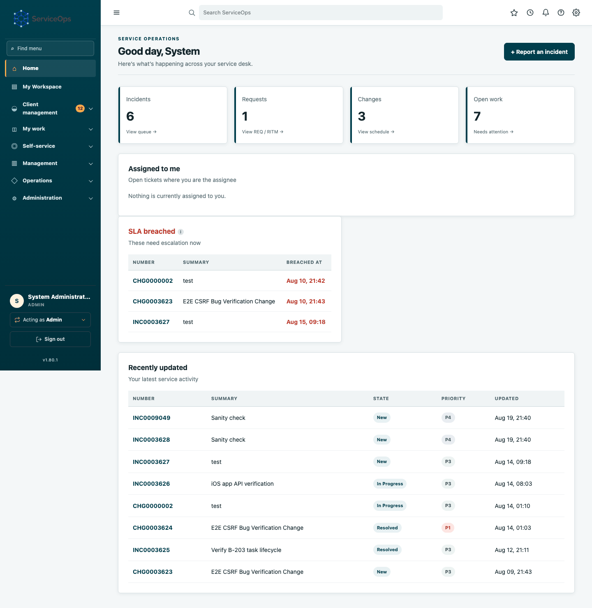

The dashboard is the landing page after sign-in. The top row of stat tiles
gives an at-a-glance count of open Incidents, Requests, Changes, and total
Open work; each tile is a link straight into the matching filtered list, and
the Incidents tile turns red with a P1/P2 breakdown whenever a high-priority
incident is open. Below that, **Assigned to me** lists your own open tickets
ordered by priority. **SLA breached** and **SLA at risk** only appear when
there is something in them — an empty service desk means an empty dashboard,
not two panels permanently reading "nothing here." **Recently updated** shows
the last eight records touched anywhere you have visibility into, useful for
picking back up after a context switch. Administrators can turn any of these
panels on or off tenant-wide from **Administration home → Platform settings → Workspace defaults**.

### My Workspace

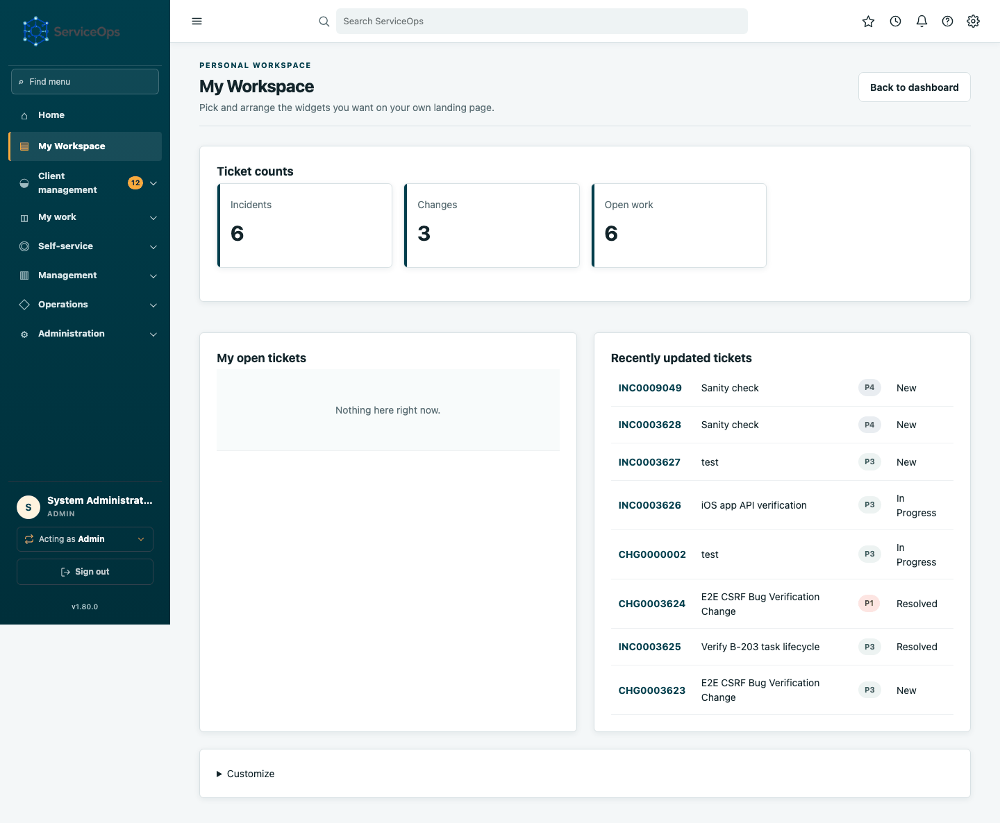

**My Workspace** (`/workspace`) is an alternative, personal landing page each
user can lay out to their own preference, sitting alongside the shared
Dashboard rather than replacing it. Its widget catalog is closed and
code-defined — ticket stats, my open tickets, recent tickets, SLA-at-risk,
approvals awaiting me, favorites, recently viewed, and notifications — not a
general-purpose page designer; an administrator can disable individual
widgets tenant-wide from Platform settings, and each user's own layout is
saved independently of everyone else's.

### Incidents list

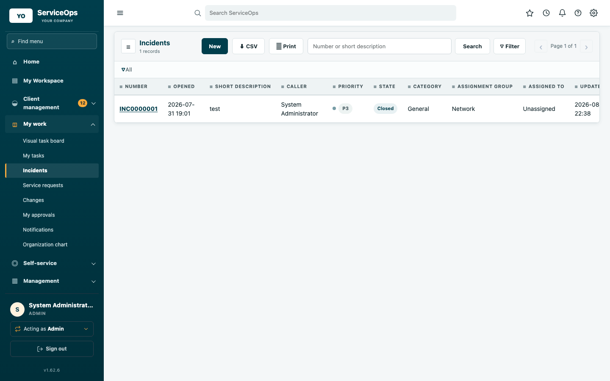

Every ticket list in ServiceOps (Incidents, Changes, Requests) shares the same
list-workspace layout: a toolbar with a **New** button, a state filter, a free-text
search box that matches both the record number and its short description, and
pagination controls showing the current page and total record count. The
table itself is sorted by most-recently-updated first and color-codes priority
with a small dot (red for P1, amber for P2) so urgent work is visually
distinct while scrolling a long list. Clicking any row's number opens that
record's detail page.

### Incident detail

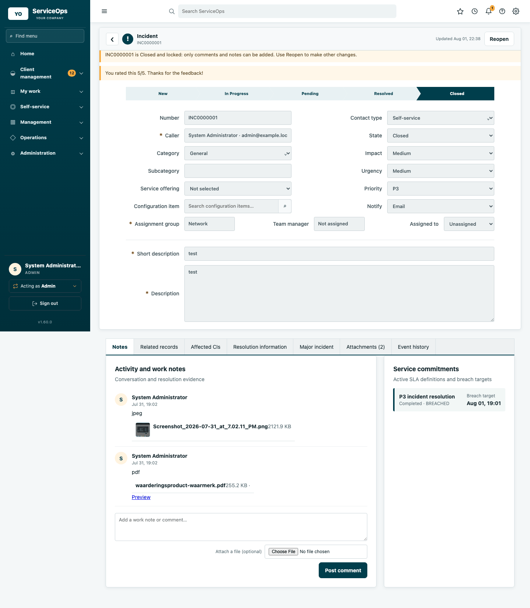

The incident detail page is built on the same "record shell" used for every
ITIL record type in ServiceOps: a header bar with the record number and
permitted actions (Update, Resolve), a horizontal lifecycle stepper showing
exactly which state the record is in and which states are still ahead, a
dense two-column form for the operational fields, and a chronological Event
history immediately below recording every field change with who made it and
when. Only an active member of the incident's owning fulfillment team (or an
administrator) can change these fields — other teams can open this same page
to read it for cross-team awareness, but the form controls stay disabled for
them.

### Changes list

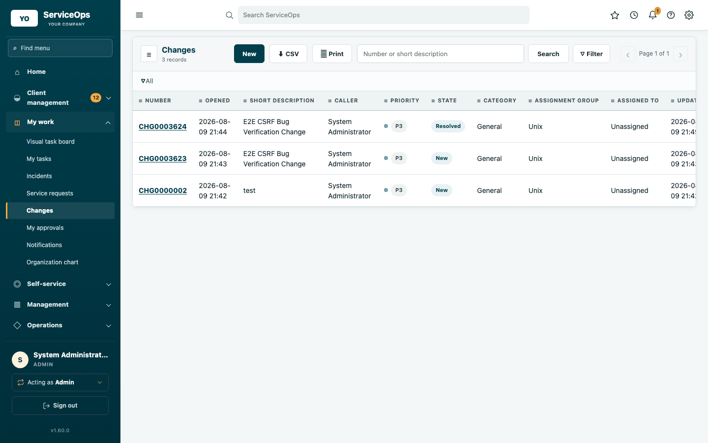

Changes use the identical list layout as incidents, but every row here
represents a controlled production modification rather than a service
interruption. Look at the State column to distinguish a change that's still
`Awaiting Approval` from one already `Approved` and scheduled, or already
`Implemented`. Standard, Normal and Emergency changes are all shown together
in this list — open the record itself to see which governance path applies
(see "Changes" earlier in this manual for the approval rules each type
follows).

### Requests & catalog

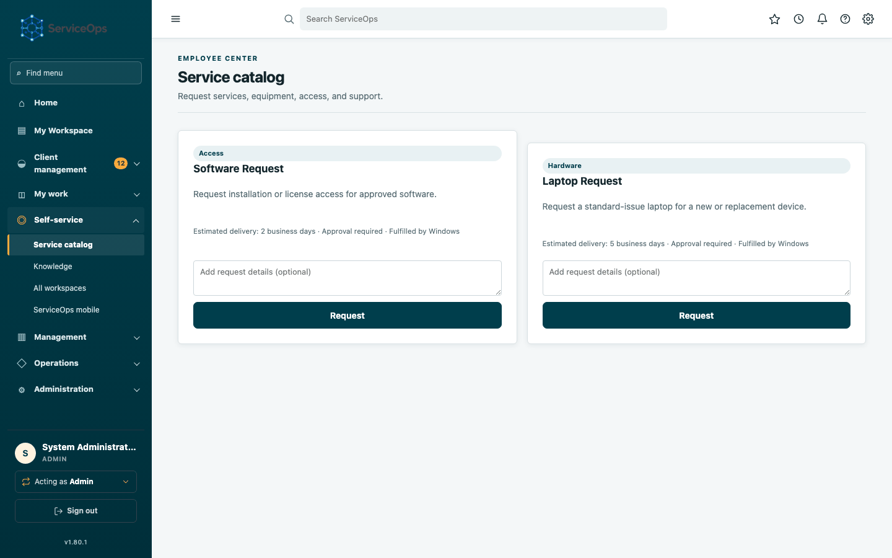

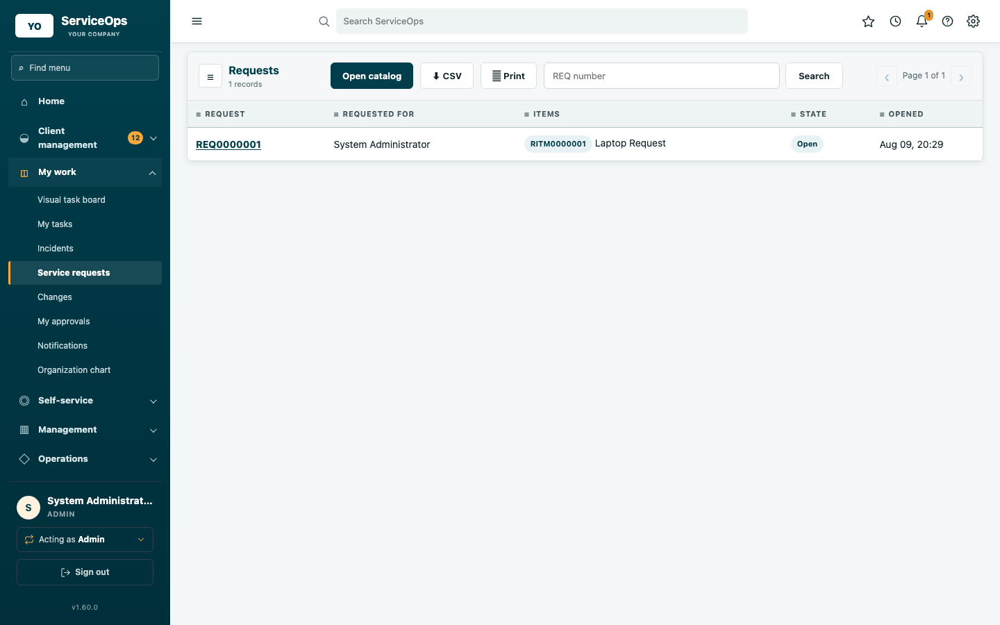

The **Service catalog** page is where end users browse and order predefined
items. Each card states up front whether approval is required and which team
will fulfill it, so there are no surprises about turnaround time. Submitting
the form creates a REQ (the order) and one RITM per item ordered; the
**Requests & RITMs** list is where you track those containers afterward,
independent of the catalog itself.

### Requested Item (RITM) detail

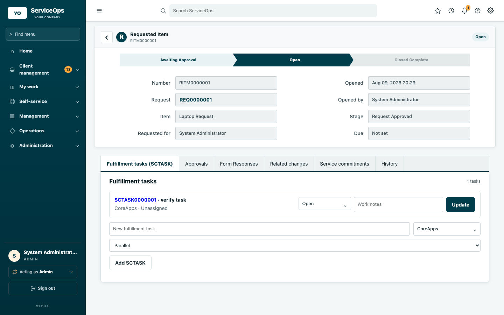

Opening a REQ shows its constituent RITMs; opening a RITM shows this page.
The lifecycle stepper here reflects the RITM's own three-stage journey —
approval, open fulfillment, and completion — distinct from the parent REQ's
own state. Below the header, the **Fulfillment tasks** panel lists every
SCTASK generated to actually deliver the item, each independently assignable
to a fulfillment team; the RITM itself only reaches `Closed Complete` once
every one of its SCTASKs finishes.

### Open work

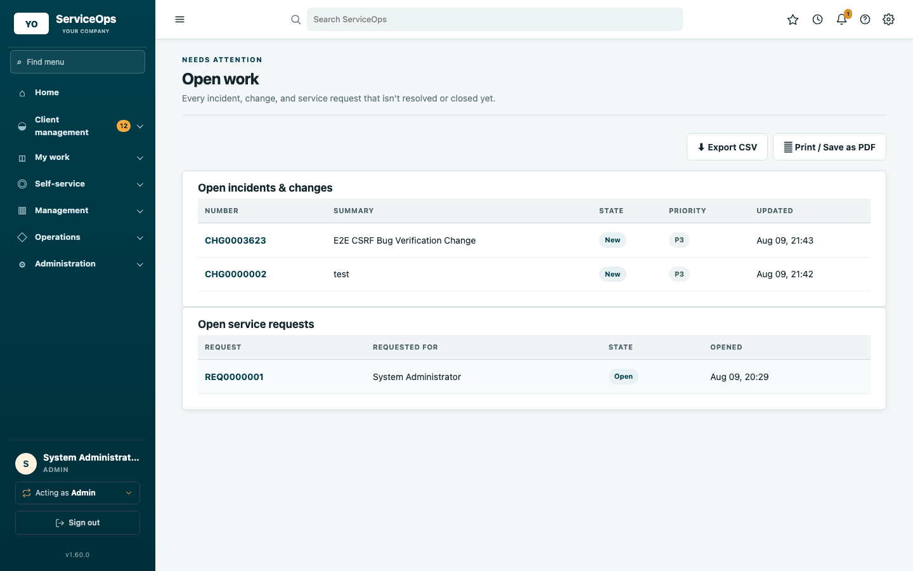

This is the single cross-cutting view of everything still outstanding,
combining incidents, changes and requests into one list rather than three
separate ones. It is capped at 200 rows per section to stay responsive on a
busy service desk — a truncation notice appears with links to the fully
filterable Incidents/Changes lists if there's more to see. Use the priority
filter (linked from the dashboard's P1/P2 alert) to narrow straight to the
highest-urgency backlog.

### My tasks

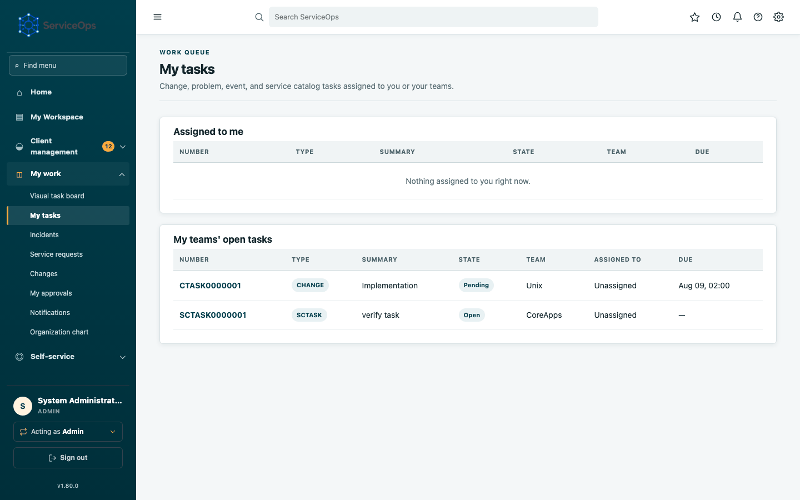

Agents and managers use this page as their personal work queue. **Assigned
to me** is exactly that — CTASKs, PTASKs and SCTASKs with your user ID as
the assignee, sorted so the nearest due date surfaces first. **Team tasks**
below it shows everything else open against a team you belong to but not yet
picked up by anyone, which is where you'd look to grab the next piece of
unassigned work. The sidebar's "My tasks" link itself carries an amber badge
whenever you have open work assigned, so you don't have to open the page to
know something is waiting.

### Visual task board

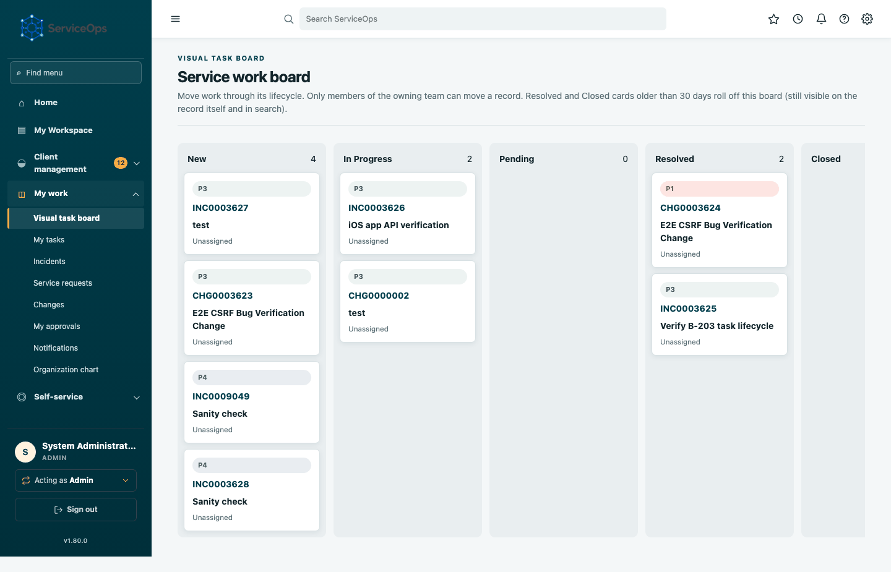

The task board gives a Kanban view of tickets you're permitted to manage.
Dragging a card between lanes changes the underlying ticket's state exactly
the same way editing the record's State field would — it is a different
interaction model over the same governed transition rules, not a shortcut
around them, so an invalid drag (e.g. skipping a required approval state) is
rejected the same way an invalid form edit would be.

### CMDB & service map

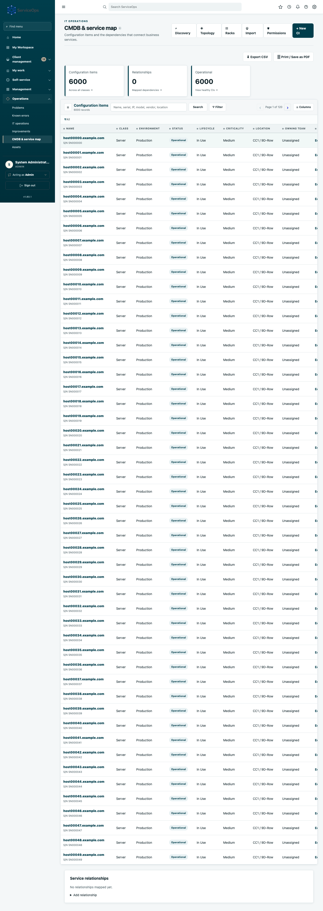

The Configuration Management Database is the system of record for every
server, application and service ServiceOps tracks, and how they depend on one
another. Each CI carries a lifecycle state (separate from its operational
status — a CI can be operationally `Operational` while its lifecycle state is
`Planned` ahead of go-live, for example), a business-criticality rating used
elsewhere in change-conflict detection, and an owning support team.
Relationships beneath the CI table (e.g. "Customer Portal — Depends on →
Payroll Database") are what powers change-conflict detection: scheduling a
change against a CI that another in-flight change already touches, directly
or through a relationship, surfaces a conflict warning before approval.

### Org chart

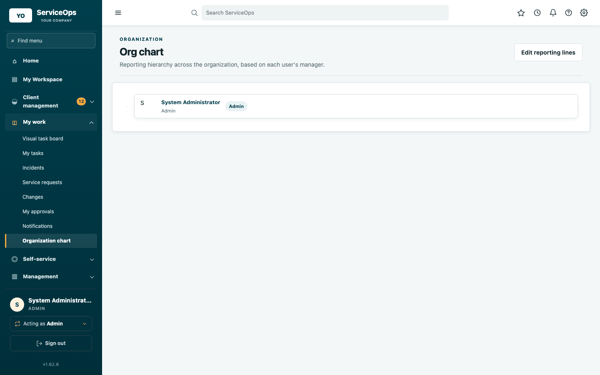

The org chart is generated automatically from each user's configured manager
field — there's no separate org-chart data entry, so it's always consistent
with **Users & roles**. Nodes with reports show a collapse toggle so a large
organization can be explored level by level instead of one long scroll.

### Manager portal

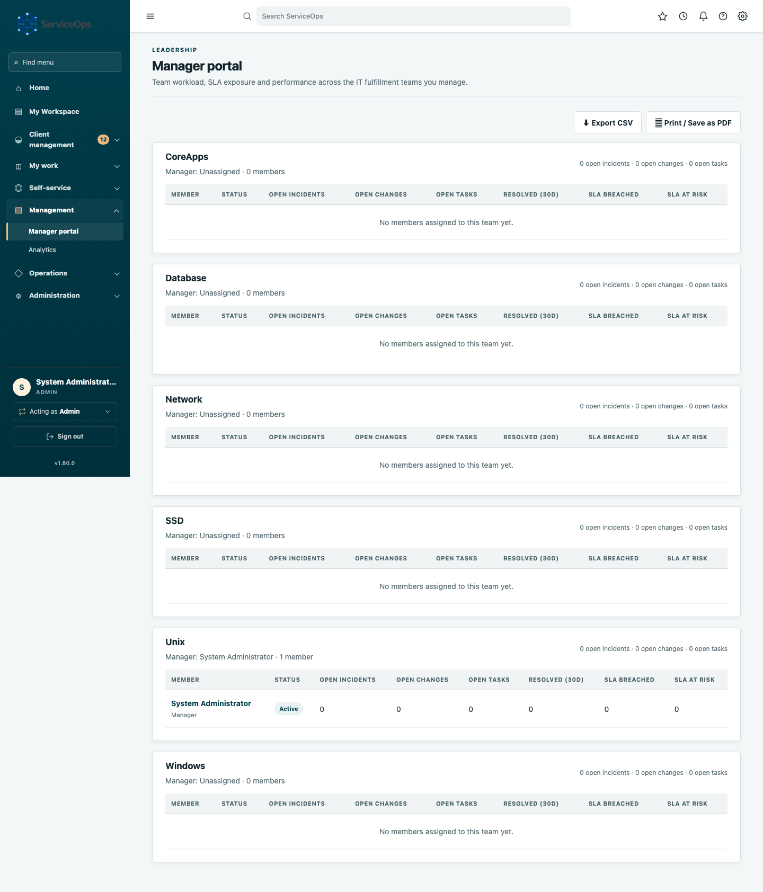

This is the primary reporting surface for a team manager. Each team you
manage gets its own panel; inside it, every team member has a row showing
their active/inactive status, how many incidents/changes/tasks are currently
open against them, how many tickets they've resolved in the last 30 days, and
their personal SLA breached/at-risk counts. The **Export CSV** and
**Print / Save as PDF** buttons at the top let this exact view be pulled into
a spreadsheet or a printed report for a status meeting without re-deriving
the numbers by hand.

### Analytics

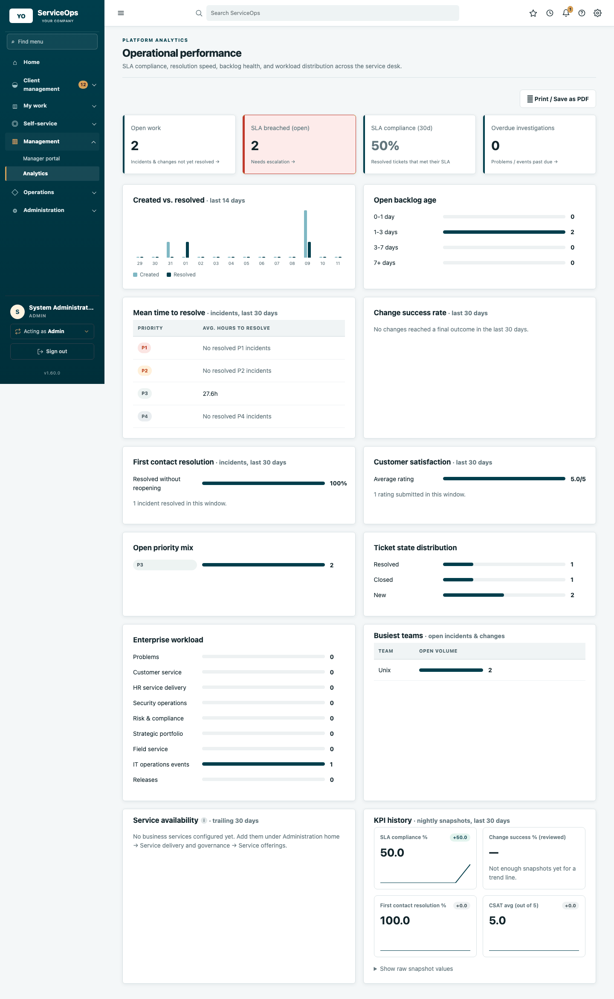

Analytics is the tenant-wide operational-performance view, distinct from the
manager portal's per-team/per-person focus. The created-vs-resolved trend
chart is the fastest way to see whether the backlog is growing or shrinking
week over week; backlog aging shows how long currently-open tickets have
been sitting, which is often a better early-warning signal than raw open
counts; and mean-time-to-resolve by priority is the number most worth
tracking over time as a service-desk health metric.

### My approvals

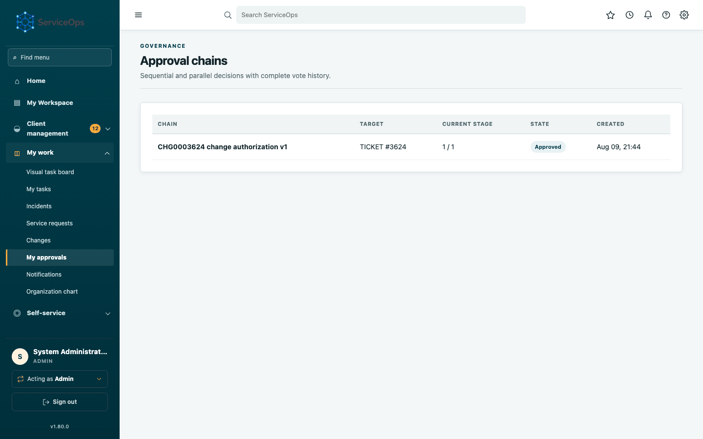

Anyone named as an approver — a team manager, a CCB member — sees their
pending decisions here rather than having to remember to check every change
or RITM individually. The sidebar's "My approvals" link carries the same
amber badge treatment as "My tasks": if there's nothing waiting on you, there
is no badge; if there is, the count is right there before you open the page.

### Notifications

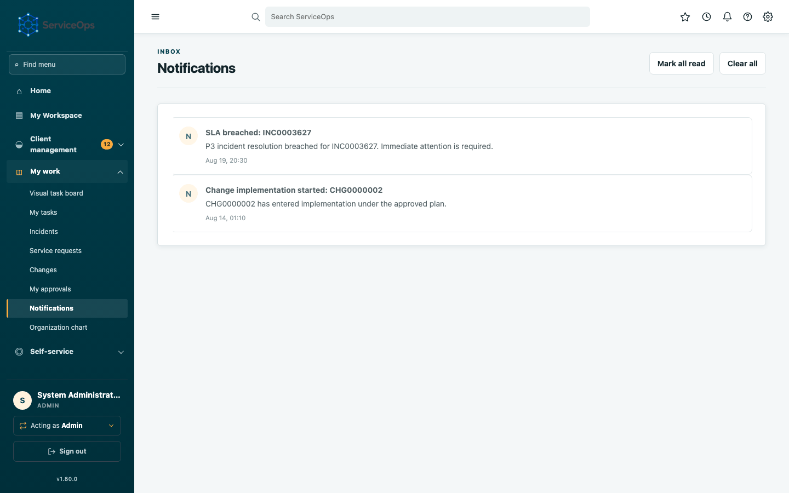

Notifications are generated for the events you'd actually want to react to —
an SLA breach on your ticket, a new approval request, a comment on something
you're following. Unread items stay visually distinct until you click
through to the record they refer to; opening the notifications page itself
no longer silently marks everything read the moment you look at it.

### Knowledge base

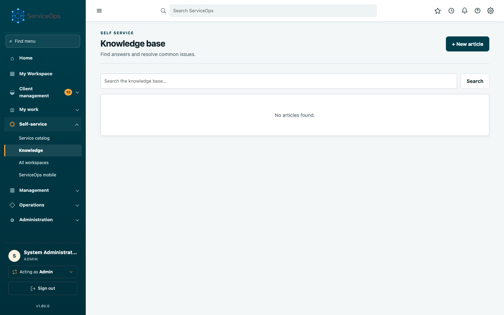

Search knowledge before opening a duplicate incident or RITM — a workaround
or a known error entry here can resolve a user's problem immediately without
creating new operational work at all. Problems (PRB records) link back to the
knowledge article that documents their permanent fix once root cause is
found, closing the loop between "we investigated this once" and "here's how
to solve it fast next time."

### Administration home → Platform settings

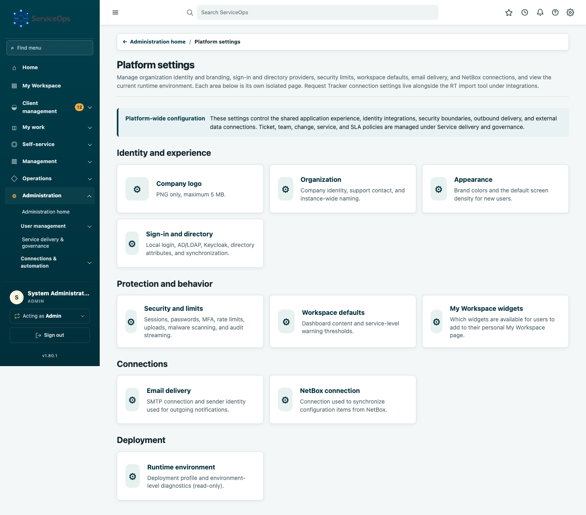

Every tenant-wide behavior this manual describes as configurable — branding,
security limits, dashboard panel visibility, SLA warning windows, the new
REST API rate limit, LDAP/Keycloak connection details — is set from this one
page. Each field's badge tells you whether a change takes effect immediately
(**Live**) or needs a full application restart/rollout to propagate to every
running instance (**Restart required**) — this distinction matters most in a
multi-replica Kubernetes deployment, where a Live setting is read fresh from
the database by every request but a Restart-required identity-provider change
must reach every pod consistently.

### Users & roles

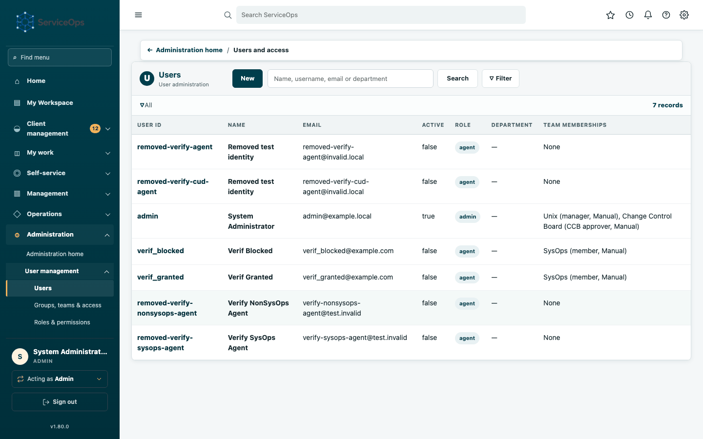

Administrators manage the full user lifecycle here: role assignment, active/
inactive state, department, manager (which drives the org chart), and team
membership. AD/LDAP-sourced accounts continue to reconcile their team
membership automatically from directory group mappings on every login: an
administrator editing team membership here only affects locally-managed
accounts, or overrides that get reconciled again on the next directory sync.

### Audit log

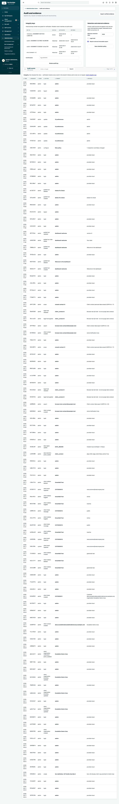

Every create, update, approval decision, and administrative action is
recorded here with a cryptographic hash chain linking each event to the one
before it, so the log itself can prove whether it has been tampered with.
This is the evidence trail an external auditor or incident responder would
ask for first; see "Ticket history and change reapproval" earlier in this
manual for how per-record history relates to this tenant-wide audit stream.

### Administration home → Service delivery and governance

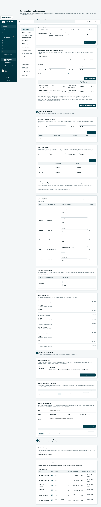

This is where the process framework itself is configured, as opposed to
day-to-day operational work: which team fulfills which catalog item by
default, what an SLA's target duration and business calendar are, and who
holds CCB approval authority. Changes made here govern all future tickets and
requests; they do not retroactively alter SLA targets already attached to an
in-flight ticket.

### Guided tours administration

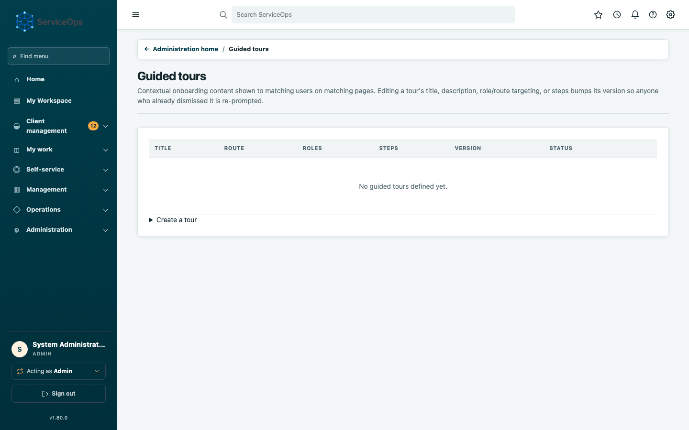

Administrators author step-by-step guided tours here (`/admin/guided-tours`)
— ordered steps, versioning, and role targeting so a tour can be scoped to
just the roles it's relevant for. End users see active tours play back as a
lightweight on-page overlay; each user's progress through a tour is recorded
so it doesn't replay from the start on their next visit.

### Data governance administration

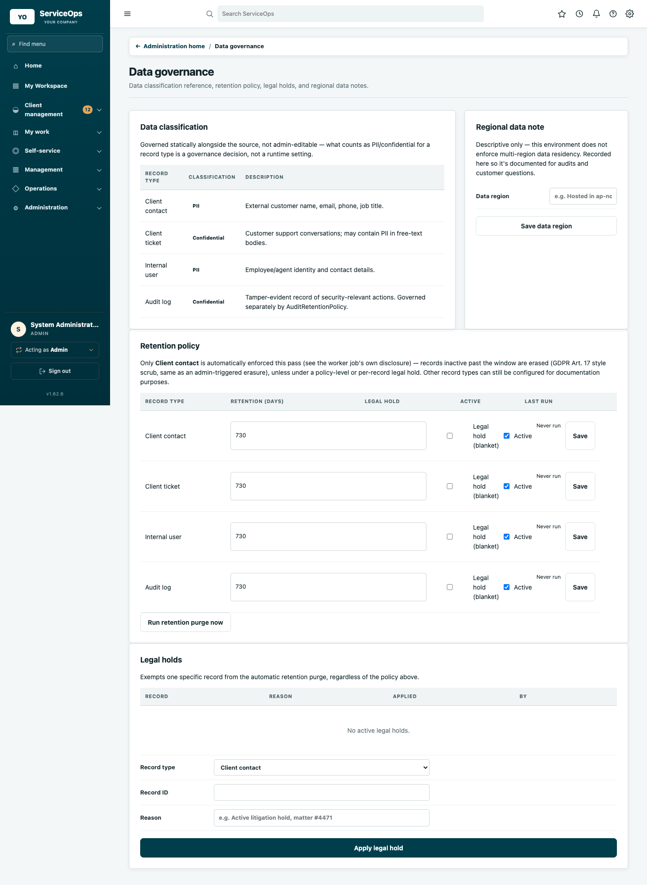

The data governance page (`/admin/data-governance`) is where retention
policies and legal holds are defined, and where classification-driven
GDPR Art. 17/20-style erasure and export requests for client contacts are
reviewed and actioned. A legal hold on a record blocks its scheduled
retention-driven deletion regardless of policy, until explicitly lifted.

### Client support mailbox administration

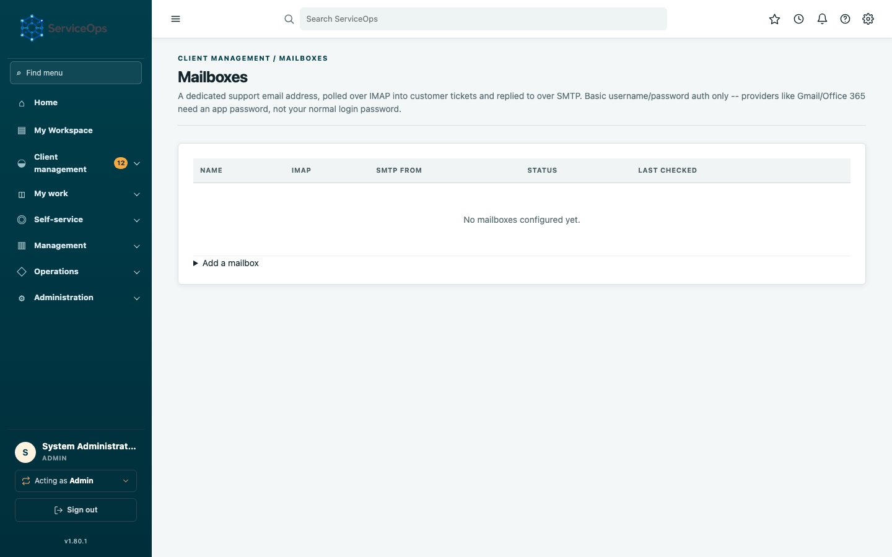

The Client Management support mailbox page (`/client-management/mailboxes`)
configures a real IMAP/SMTP inbox that automatically becomes Client tickets:
inbound mail is polled, threaded onto existing tickets by Message-ID/subject
token, and creates a new ticket (with contact/organization auto-matching)
when nothing matches; agent replies go back out through the same mailbox's
SMTP, correctly threaded. Only basic-auth IMAP/SMTP is supported — providers
like Gmail/Microsoft 365 that require OAuth or an app password need one
configured here rather than the account's normal password.

## 3B. Common task walkthroughs

### Report and resolve an incident

1. Click **+ Report an incident** on the dashboard, or **New** from the
   Incidents list.
2. Provide a concise title, observable symptoms, category/subcategory and
   business impact/urgency; ServiceOps calculates priority from impact and
   urgency automatically.
3. Submit — the incident is created in state `New` and routed to its owning
   fulfillment team.
4. An agent from that team opens the record (see the Incident detail
   screenshot above), sets it `In Progress`, and works the issue: comments,
   attachments, checklist items and CI links are all recorded in the Event
   history as they happen.
5. Once service is restored, the agent sets state to `Resolved`; a manager or
   the same agent later moves it to `Closed` once confirmed with the caller.

### Submit a Normal change through approval

1. From the Changes list, click **New**, select change type `Normal`, and
   complete the required implementation plan, test plan, backout plan,
   planned window, primary configuration item and owning team; use **Add
   another configuration item** if the change touches more than one CI.
2. On submission ServiceOps runs conflict detection against other in-flight
   changes touching the same CI or a related one, and creates a two-stage
   approval chain: the owning team's manager first, then the CCB.
3. The change sits in `Awaiting Approval` until both gates are satisfied —
   visible on **My approvals** (see the amber sidebar badge) for anyone named
   as an approver.
4. Once approved, the change moves to `Approved` and its change tasks (CTASK)
   can begin; a required CTASK still open blocks the change from completing.
5. Editing a material field (plan, risk, affected CI, schedule) after
   approval automatically supersedes the existing chain and starts a new one
   — an old approval is never silently applied to a changed plan.

### Order an item from the service catalog

1. Open the **Service catalog** page, pick an item, add any requested
   details, and click **Request**.
2. ServiceOps creates a REQ container and one RITM for the item; if the item
   requires approval, an approval chain starts (manager, then the fulfilling
   team) before any fulfillment work begins.
3. Track status from **Requests & RITMs** — open the RITM itself to see its
   own lifecycle stepper and the SCTASKs doing the actual fulfillment work.
4. The RITM reaches `Closed Complete` once every SCTASK finishes; the parent
   REQ reaches its own terminal state once every RITM in it does.

### Review team performance as a manager

1. Open **Management → Manager portal** from the sidebar.
2. Each team you manage has its own panel with team-level open-work and
   SLA-breach totals, and a per-member table below it.
3. Use the per-member columns (open incidents/changes/tasks, 30-day resolved
   count, SLA breached/at-risk) to spot who's overloaded or who has SLA risk
   building up before it becomes a breach.
4. Use **Export CSV** to pull the exact table into a spreadsheet, or
   **Print / Save as PDF** to produce a printable report for a status
   meeting — both reflect exactly what's on screen.

## 4. Deployment decision

| Environment | Application | Database | Upload storage |
|---|---|---|---|
| Single server | Docker Compose | Bundled PostgreSQL | Docker volume |
| Single production server | Docker Compose behind HTTPS proxy | Bundled or external PostgreSQL | Docker volume with backups |
| Enterprise production | Kubernetes/Helm, 3+ replicas | Managed HA PostgreSQL | RWX CSI volume or object-storage extension |

Production Kubernetes must use an externally operated, highly available PostgreSQL service.

## 5. Docker installation

Run `./serviceops install web`, open `http://127.0.0.1:8090`, configure the profile,
database, identity providers, and listener, validate all checks, confirm, and
deploy. Keep the terminal open until the browser reports a healthy deployment.

Use `./serviceops status`, `health`, `logs`, `backup`, `restore`, and
`doctor` for lifecycle operations. Put Caddy, NGINX, or an enterprise load
balancer in front of the loopback-bound application and terminate TLS there.

## 6. Kubernetes prerequisites

- Kubernetes 1.27 or newer with at least three worker nodes for HA.
- Helm 3, kubectl, a default-deny-capable CNI, and a CSI storage provider.
- A private image registry and immutable ServiceOps image tag or digest.
- External HA PostgreSQL with TLS, automated backups, and point-in-time recovery.
- RWX upload storage when application replicas exceed one.
- An ingress controller, DNS, and automated TLS certificate management.
- Metrics Server for HPA; cluster monitoring and log aggregation.
- A secrets controller or external vault for steady-state secret rotation.

## 7. Kubernetes installation

1. Build, scan, sign, and push an immutable image.
2. Copy `deploy/kubernetes/values-production.example.yaml` to
   `deploy/kubernetes/values-production.yaml`.
3. Set registry, immutable tag, ingress, storage class, replicas, identity
   endpoints, and role mappings.
4. Run `./serviceops install kubernetes --preflight`.
5. Run `./serviceops install kubernetes`.
6. Confirm rollout, Helm test, ingress TLS, login, record creation, upload,
   approval, notification, and audit behavior.

The installer labels the namespace for Restricted Pod Security, creates secrets
from a protected temporary file, uses `helm upgrade --install --atomic --wait`,
waits for rollout, and runs the packaged `/ready` test.

## 8. Kubernetes chart controls

- Non-root UID/GID, RuntimeDefault seccomp, all capabilities dropped.
- Read-only root filesystem and disabled service-account-token mounts.
- Startup, readiness, and liveness probes with distinct semantics.
- Rolling update with zero unavailable replicas.
- Topology spreading across zones and hosts.
- PodDisruptionBudget and optional HPA.
- Resource requests and limits.
- NetworkPolicy for ingress and required egress ports.
- Persistent upload claim and optional ingress/TLS.
- JSON schema validation and a Helm test hook.

Tune topology keys to the labels present in the target cluster. A PDB protects
only against voluntary disruptions; it does not protect against node, zone, or
application failure.

## 9. Identity configuration

### Local administrator

Keep local authentication enabled for one vaulted break-glass administrator.
Test it quarterly under an approved access procedure. Rotate after every use.

### AD/LDAP

Use LDAPS or StartTLS, certificate validation, a least-privilege read-only bind
identity, a narrow base DN, an escaped username filter, and explicit group-role
mappings. Validate bind, search, user bind, disabled-user behavior, group
mapping, certificate expiry, and directory outage behavior.

### Keycloak

Use a confidential OIDC client, authorization-code flow, exact HTTPS redirect
URI, short-lived tokens, approved realm-role claims, client-secret rotation,
and restrictive redirect/web-origin settings. Validate login, logout, expired
session, revoked user, missing email, role changes, and provider outage.

In addition to name/email/role claims, Keycloak/OIDC login can populate the
same profile fields LDAP sync does — title, department, division, employee
ID, employee type, business phone, mobile phone, and location — from OIDC
userinfo claims, via the admin-configurable `KEYCLOAK_ATTR_MAP` setting
(Administration home → Platform settings → Sign-in and directory), a
`{ServiceOps field: claim name}` JSON map mirroring `LDAP_ATTR_MAP`'s shape.
Populate it with a realm's actual custom protocol-mapper claim names (e.g.
`department`, `employee_id`, `phone_number`); an empty map skips profile
mapping and only name/email/roles are applied, as before. As with LDAP sync,
a sparser claim set on a later login never nulls out a profile value a
previous login already set.

### LDAP directory synchronization

In addition to interactive AD/LDAP login (which creates the `ExternalIdentity`
row for a user on first login), ServiceOps can periodically enrich already
LDAP-provisioned user records from the directory: profile fields (`title`,
`department`, `division`, `employee_id`, `employee_type`, `business_phone`,
`mobile_phone`, `location`), the manager reporting chain (`User.manager_id`),
and AD-group-driven team membership.
This is implemented in `serviceops_core/ldap_sync.py::sync_directory` and
does **not** create new users — only accounts that already authenticated via
LDAP at least once are matched and updated, by directory DN.

Two ways to run it:

- **Manual**: Administration home → Service delivery and governance → Directory synchronization
  triggers an immediate synchronous run (with a dry-run preview option) for
  the current tenant and shows a result summary (entries read, users
  updated, managers resolved, memberships added/removed, unmatched entries,
  errors).
- **Scheduled**: the `worker` container's existing in-process polling loop
  (`tools/outbox_worker.py`, the same loop that already processes SLA
  breaches, workflow schedules/jobs, and the outbox) also calls
  `app.process_ldap_sync_schedule()` on every pass. For each **active**
  tenant with both `LDAP_ENABLED` and `LDAP_SYNC_ENABLED` set, it checks a
  per-tenant `ldap_sync_state` table row and runs `sync_directory(tenant.id)`
  once the configured interval has elapsed since that tenant's last run. A
  failure syncing one tenant is logged (no secrets) and never blocks or
  crashes the sync of other tenants or the rest of the worker loop. There is
  no default or fallback tenant — iteration is always by explicit,
  individually-flagged tenant, consistent with the platform's fail-closed
  tenant policy.

Relevant settings (Administration home → Platform settings → Sign-in and directory):

| Setting | Purpose |
|---|---|
| `LDAP_ATTR_MAP` | JSON map from ServiceOps profile/manager/email/username fields to the directory's actual attribute names (e.g. AD `employeeID` vs. an OpenLDAP equivalent). Defaults match typical Active Directory attributes, including `business_phone`→`telephoneNumber`, `mobile_phone`→`mobile`, `location`→`physicalDeliveryOfficeName`. |
| `KEYCLOAK_ATTR_MAP` | The same shape of JSON map, applied to Keycloak/OIDC userinfo claims instead of LDAP attributes (see **Keycloak** above). Independent of `LDAP_ATTR_MAP` — a tenant can run either or both providers with their own mappings. |
| `LDAP_SYNC_ENABLED` | Enables the scheduled sync for this tenant. Default off; manual sync is always available regardless of this flag. |
| `LDAP_SYNC_INTERVAL_MINUTES` | Minimum minutes between scheduled sync runs per tenant (5–10080). Default 60. |

Operational notes:

- Directory attributes that are absent or empty are never used to null out
  existing ServiceOps values (sparse directory entries do not erase data).
- A manager DN outside the search filter/base DN is left unresolved rather
  than failing the whole sync.
- All directory attribute names are admin-configurable; nothing about a
  specific company's schema is hard-coded.
- This does not populate org-chart/manager data for interactively-created
  local accounts that have never authenticated via LDAP.

## 10. Post-deployment system settings

Administrators can open **Administration home → Platform settings** after deployment
to change the platform name, company name, PNG logo, primary and accent colors,
support identity, display defaults, LDAP, Keycloak, encrypted provider secrets,
security limits, workflow defaults, and notification identity.

Each field is marked either **Live** or **Restart required**. Live settings are
read from PostgreSQL by every request. Restart-required identity-client changes
must be followed by a complete Compose restart or Kubernetes rollout so every
application instance receives the same client configuration.

Database topology, replicas, storage, ingress, and TLS remain controlled by
Compose or Helm and are displayed read-only. This prevents one pod from
silently diverging from the declared infrastructure.

Sensitive values are encrypted before storage and are never returned to the
browser. Set a durable `SETTINGS_ENCRYPTION_KEY` during installation; changing
or losing that key makes existing encrypted settings unreadable.

### Priority and SLA policy

Ticket priority is calculated from impact and urgency using the validated,
Git-backed `config/priority_matrix.json`. Agents cannot silently override the
result. A manager or administrator may select a different priority only while
supplying an auditable reason of at least ten characters.

Administrators manage business calendars and SLA definitions under
**Administration home → Service delivery and governance**. Calendars use IANA timezone names, explicit business
weekdays and opening hours, plus named excluded holiday dates. An SLA without a
calendar remains a 24x7 wall-clock commitment. A calendar change applies to
future SLA attachments; it does not silently rewrite targets already in flight.

The worker detects newly breached commitments, writes one breach event to the
SLA evidence stream, records the breach in the ticket history, and notifies the
owning-team manager and assigned engineer through the durable outbox. Monitor
the worker continuously; a stopped worker delays escalation but does not lose
the stored target or breach state.

### Declarative workflow operations

Workflow source is controlled in `config/workflows.json`. On startup ServiceOps
validates the package and publishes a new immutable PostgreSQL runtime version
only when the canonical specification changes. Administrators can inspect the
deployed hash and versions, redeploy the packaged source, and run a mutation-free
simulation under **Administration home → Automation rules**.

The supported foundation accepts `ticket.state_entry` events, equality,
inequality, membership and empty-value conditions over explicitly allowed
ticket fields, plus three actions: add ticket history, notify the requester,
and notify the owning-team manager. Arbitrary administrator scripts and
unsupported fields/actions fail package validation.

State transitions enqueue a unique correlated job in the same transaction as
the operational change. The worker claims jobs using PostgreSQL coordination,
records the exact published version and masked structured input/output, and
commits actions atomically. Failures use bounded exponential retry and enter
`Dead` after five attempts. Monitor both workflow jobs and execution evidence
from the administration page; investigate dead jobs before replaying them.

Release 1.13.0 extends the runtime with durable waits, per-action execution
evidence, manual/API/SLA-breach triggers, per-workflow rate limits, controlled
dead-job replay, and safe terminal compensation. A wait commits its cursor and
resume timestamp to PostgreSQL; after restart the worker continues at the next
action and does not repeat completed steps.

API workflow triggers require the explicit `workflows:execute` scope, the
acting user's operational permission for the ticket, and an idempotency key.
Rate-limited jobs are delayed without consuming a failure attempt. Failed jobs
retry five times; compensation runs only after the terminal failure and is
currently restricted to an auditable ticket-history action because delivered
notifications cannot truthfully be undone.

Release 1.13.0 does not yet claim scheduled recurrence, reusable subflows,
general rollback, broad record mutation, concurrency quotas, or complete
multi-environment configuration promotion. Those remain governed backlog work.

Release 1.14.0 adds reusable subflows to workflow package schema v2. Subflow
references are validated before deployment, unknown dependencies fail closed,
and dependency cycles are rejected. Valid subflows are expanded into the
immutable published workflow specification, so runtime execution never depends
on mutable external fragments.

Administrators configure recurring ticket schedules under
**Administration home → Automation rules**. Each schedule is tenant-scoped, targets one
ticket, uses a bounded minute interval, and can be enabled or disabled without
deleting its evidence. Concurrent workers claim due schedules with PostgreSQL
row locking. The event and next-run advancement commit together. If the system
was offline for several intervals, it emits one event and advances directly to
the next future interval instead of creating a catch-up storm.

Calendar expressions, blackout windows, package dependencies, per-tenant
concurrency quotas and production-scale scheduler failure testing remain
governed backlog work.

### Bootstrap credential retirement

ServiceOps reads `ADMIN_PASSWORD_FILE` before the legacy `ADMIN_PASSWORD`
environment value. Kubernetes separates the bootstrap credential from runtime
secrets and never injects it into workers. Compose workers likewise receive no
bootstrap administrator credential.

After the first successful installation:

1. Sign in as the local administrator.
2. Use **Administration → Change password** to rotate the initial credential
   into a unique vault-managed password. This increments the account
   authentication version and invalidates every other browser session.
3. Store the new credential in the organizational emergency-access vault.
4. Run `./serviceops retire-bootstrap-secret`, verify the active administrator,
   type the explicit confirmation, and wait for the recreated containers to
   pass health checks.
5. Run `./serviceops doctor`; the worker-secret isolation check must pass.

The retirement operation clears only bootstrap injection from `.env`; it does
not erase or reset the administrator's salted password hash in PostgreSQL.

### Release evidence

Tagged releases run `.github/workflows/supply-chain.yml`. Every referenced
GitHub Action is pinned to a full commit SHA. The gate runs the complete test
suite, builds with maximum provenance, blocks fixable HIGH and CRITICAL
operating-system or library vulnerabilities, generates a CycloneDX image SBOM,
and publishes only after successful validation. The resulting digest is signed
keylessly with GitHub OIDC and receives GitHub SLSA build-provenance and SBOM
attestations. Registry digest inspection and `gh attestation verify` must both
succeed.

Kubernetes values must provide `image.digest`; application, worker and
migration workloads use `repository@sha256:digest`, never a mutable tag. The
installer requires `SERVICEOPS_GITHUB_ORGANIZATION`, installs the pinned
Sigstore Policy Controller and GitHub trust policy, and labels the ServiceOps
namespace for enforcement. Unsigned or untrusted matching organization images
are rejected at admission. Run `python tools/verify_supply_chain.py` locally
to detect release-policy drift.

Runtime Python and bundled PostgreSQL base images are pinned by digest and
Python dependencies use exact versions. Generate the release record with:

```bash
python tools/release_evidence.py \
  --version 1.26.3 \
  --image serviceops-app:1.26.3 \
  --output release-evidence/serviceops-1.26.3.json
```

The output records Git state, SHA-256 hashes for non-ignored source files, a
combined manifest hash, image reference and CycloneDX component inventory. A
dirty-tree marker is evidence, not approval. External vulnerability scanning,
image signing, provenance publication, registry verification and admission
enforcement remain required before organizational production approval.

## 11. Security operations

- Enforce TLS externally and enable HSTS only after HTTPS is proven.
- Store secrets in a vault; never commit `.env`, values secrets, or kubeconfig.
- Restrict namespace RBAC and database privileges.
- Scan source, dependencies, image, manifests, and exposed endpoints in CI.
- Sign images and enforce admission verification where supported.
- Forward application, ingress, Kubernetes audit, database, and identity logs.
- Alert on repeated login failures, admin changes, approval anomalies, SLA
  breaches, crash loops, readiness loss, saturation, and storage pressure.
- Patch base images and dependencies under change control.

## 12. Backup and recovery

Back up PostgreSQL and uploads as one recovery set. Encrypt backups, store them
outside the cluster, apply retention and immutability, and record restore test
evidence. For managed PostgreSQL enable PITR. Snapshotting a running database
volume alone is not a proven logical backup.

Quarterly recovery test:

1. Run `./serviceops rehearse-recovery` and `./serviceops rehearse-pitr`; retain
   both evidence records.
2. Restore into an isolated environment.
3. Restore database to the selected recovery point.
4. Restore uploads from the matching recovery set.
5. Deploy the matching immutable application version.
6. Validate counts, attachments, identities, approvals, audit, and critical
   workflows.
7. Record actual RPO/RTO and corrective actions.

The logical recovery command deliberately reports `pitr_proven=false`:
`pg_dump` cannot be replayed with WAL. The separate PITR rehearsal uses
`pg_basebackup`, continuous WAL archiving, and a named recovery target on
disposable clusters, and reports `pitr_proven=true` only after boundary and
ServiceOps integrity checks pass.

## 13. Upgrades and rollback

Run `./serviceops rehearse-upgrade` first. It creates a verified rollback set
and validates the candidate image and migration against an isolated clone while
the source remains healthy. Back up first. Review release notes and schema compatibility. Render and lint
the Helm chart, deploy to staging, run workflow regression and load tests, then
use `helm upgrade --install --atomic --wait`. Observe error rate, latency,
readiness, database health, and queues. `--atomic` rolls Kubernetes resources
back when the upgrade fails, but database schema/data rollback still requires a
release-specific tested procedure.

## 14. Monitoring and SLOs

Monitor availability, request rate, latency percentiles, HTTP errors, worker
saturation, pod restarts, readiness, CPU/memory throttling, database connection
usage, query latency, replication/backup health, volume capacity, login errors,
notification failures, and SLA breach rate. Define business-approved SLOs and
page only on actionable symptoms.

## 15. Incident response

Declare severity and incident commander, preserve evidence, stabilize service,
communicate on a fixed cadence, use tested rollback/failover, validate recovery,
and create a blameless problem record with corrective actions. Never delete
audit or operational evidence during response.

## 16. Production acceptance checklist

- [ ] Immutable, scanned image from trusted registry
- [ ] External HA PostgreSQL with TLS, PITR, and restore test
- [ ] Three or more application replicas across failure domains
- [ ] RWX persistent uploads and tested restore
- [ ] TLS ingress, DNS, HSTS, security headers
- [ ] Restricted Pod Security and least-privilege RBAC
- [ ] Network policies validated with the actual CNI and endpoint topology
- [ ] LDAP/Keycloak end-to-end tests and vaulted break-glass account
- [ ] Monitoring, logs, alert routing, dashboards, and runbooks
- [ ] Load, soak, failover, node-drain, rollback, and disaster-recovery tests
- [ ] Security review, penetration test, and formal go-live approval
